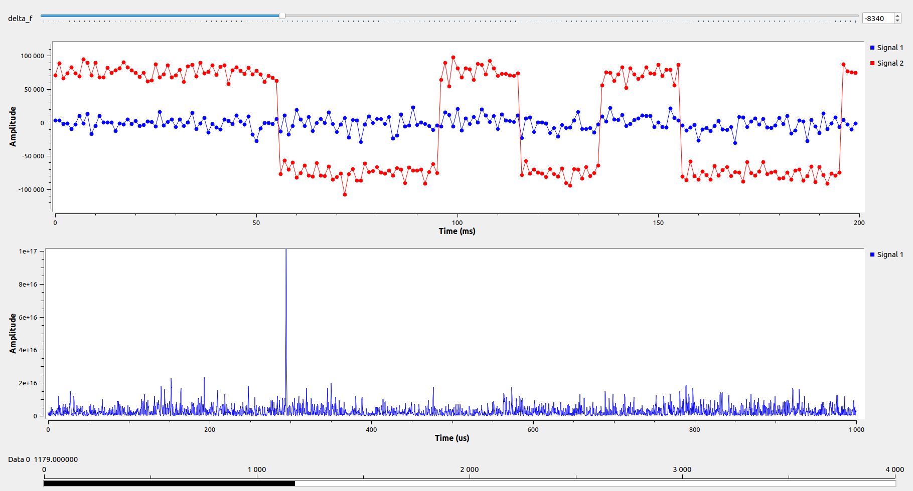

# gr-gnss

This is my attempt to build GPS (or more generally Global Navigation Satellite Systems)
receiver with a little help of gnuradio.
The best way (at least to me) to learn a new technology is to try to build a project
making use of that technology.
This is the main reason and motivation why this project was created.
At this stage of development following blocks are prepared:
- acquisition_and_tracking
  - Acquisition and tracking combined in one block. Acquisition is responsible for fast detection
    and coarse estimation of the code phase and Doppler shift of the incoming signal.
    Tracking takes output from the acquisition (code phase and Doppler shift)
    and keeps track of those two parameters as times flow.
- ca_code_generator
  - Coarse/Acquisition codes generator (source block).
- ca_symbols_to_nav_bits
  - Converts Coarse/Acquisition symbols/codes to "navigation bits".
- nav_message_decoder
  - Takes "navigation bits" and produces pseudoranges measurements (rx_time, tx_time).
    To do so it collects and parses so called navigation subframes. Subframe1 (clock related data),
    subframe2 and subframe3 (ephemeris).
- pseudoranges_decoder
  - Takes pseudoranges measurements (rx_time, tx_time) from N satellites and produces
    for each of those satellites both, position in ECEF coordinates and associated pseudorange.
    All these data are produced at one common time base.
    It requires ephemeris and clock data from navigation messages
    (of course from the same satellites as the pseudoranges measurements).
- pvt
  - Takes ECEF position and associated pseudorange from N satellies (at least 4 required)
    and produces user/receiver ECEF position. Velocity and time to be added in the future.
- rft
  - Reference frames transformations. At this moment this block can transform
    Earth Centered Earth Fixed coordinates into Geographical Coordinate System (latitude, longitude and altitude)
    and vice versa Geographical Coordinate System coordinates into Earth Centered Earth Fixed ones.
- geojson_file_sink
  - As name suggests, this is a sink block which saves GCS (latitude, longitude and altitude) positions
    in a file in geojson format. Then you may use that file for example on http://geojson.io
    to see your positions on a map.
- number_file_sink
  - Helper block, used to store output data/numbers in a file.
    I am using this block currently for storing doppler shift frequencies
    from debug port of 'acquisition_and_tracking' block. Please see 'examples/doppler_shift_svid_20.png'.

If interested, please see especially gps_acquisition_and_tracking_v4.grc
where you will be able to spot navigation message bits on the GUI Time Sink.
All the current examples are not using live signal yet but the prerecorded IQ samples (file source).
And this file is taken from GNSS-SDR project (https://gnss-sdr.org/my-first-fix).

## How to build this module

First of all you will need all the required dependencies.
Most likely you have them already installed.
I am assuming that you already have gnuradio installed. If not, please do so first.

You can go to [Installing GR from Binaries](https://wiki.gnuradio.org/index.php/InstallingGR#From_Binaries)
or [Installing GR from Source](https://wiki.gnuradio.org/index.php/InstallingGR#From_Source)
depending on your needs.

By the way, I am using gnuradio 3.8.

Then, as with every gnuradio module we use cmake.

```
  $ mkdir build
  $ cd build
  $ cmake ..
  $ make
  $ sudo make install
  $ sudo ldconfig
```

## What can I do with this module

Currently not so much. As already mentioned, this is my way of learning new technology.
What you can do is to look into examples and see how this spreading code correlation works.
gps_acquisition_and_tracking_v4.grc shows decoded navigation message bits in the GUI Time Sink.
gps_rft_v1.grc produces position vectors and suprisingly enough this positions correspond to place
where the IQ data were captured. As visible on examples/geojson.io.png there is still lots of room
for improvements.

